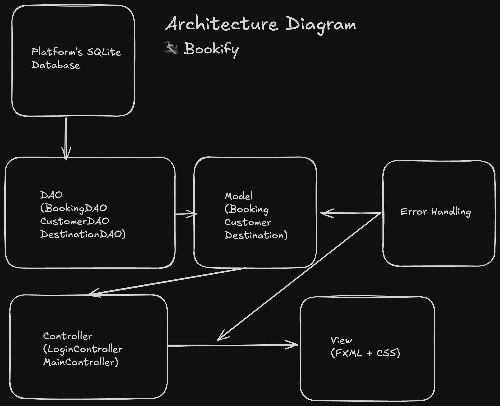
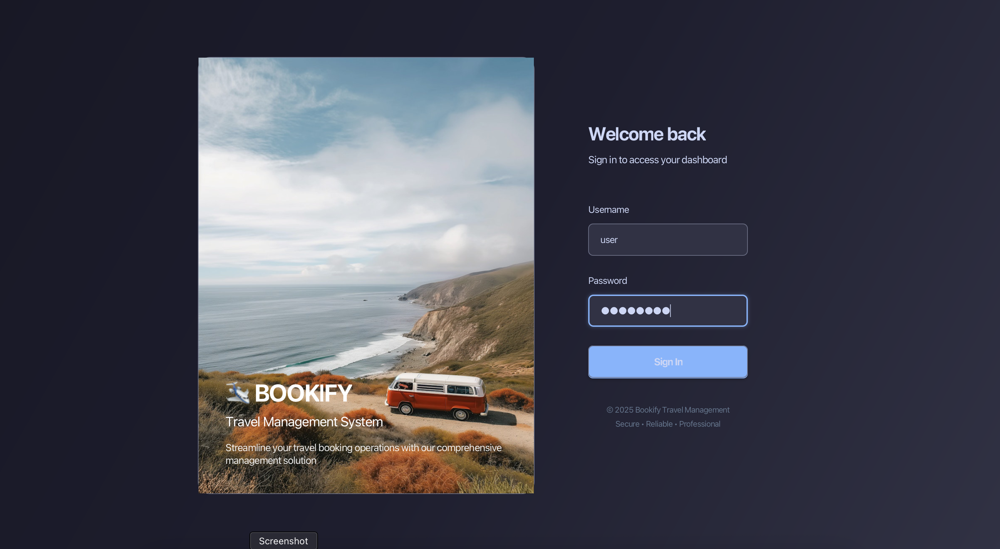
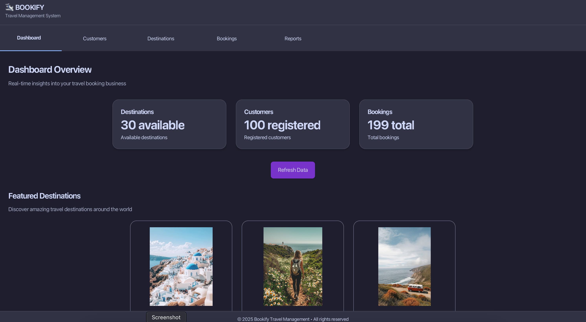
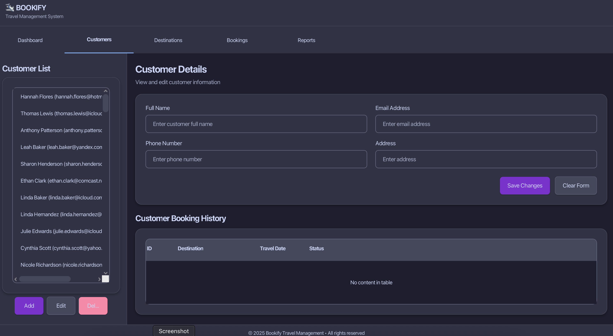
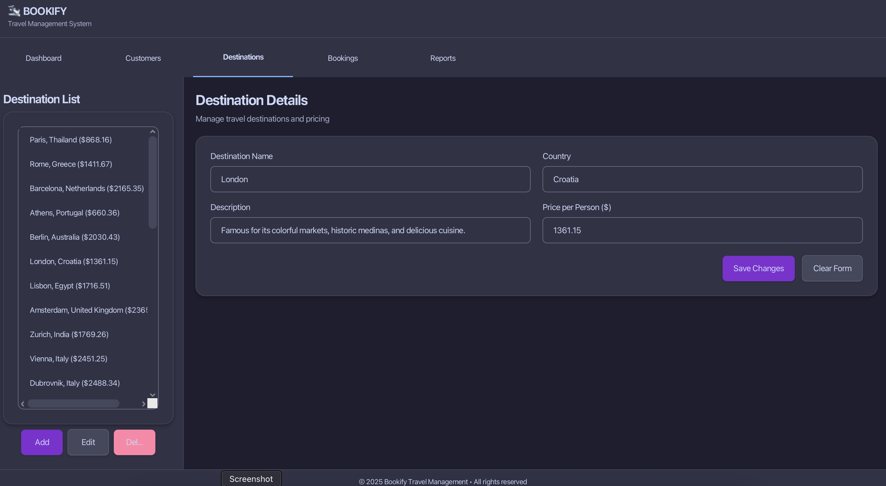
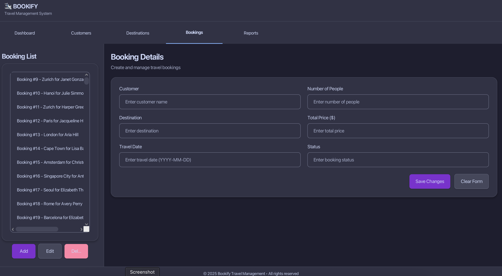
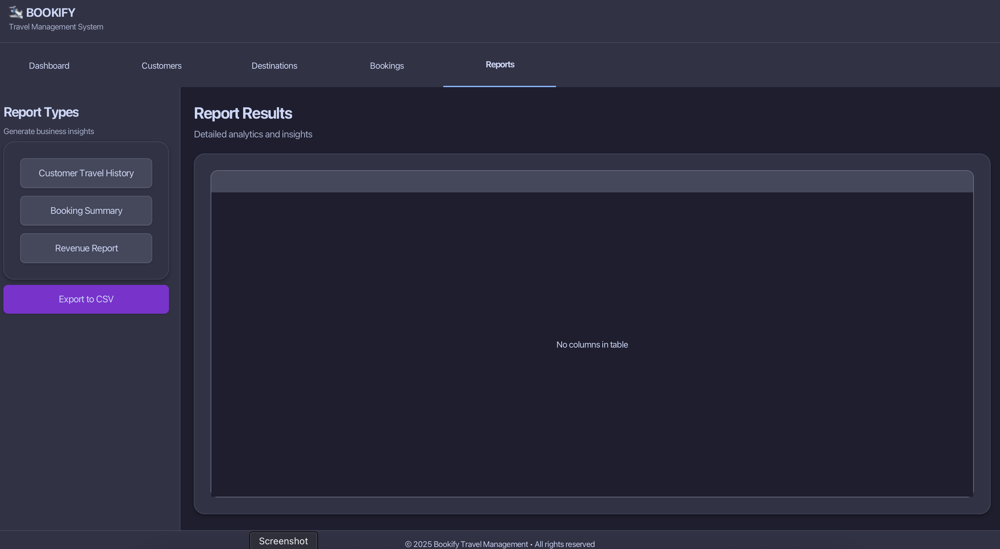

# 🛩️ Bookify – JavaFX Travel-Management Application

<p align="center">
  
</p>

Bookify is a **modern desktop app** for travel-agency back-office tasks (customers, destinations, bookings, reports).
It is written for **Java&nbsp;11+**, uses **JavaFX 21**, is built with **Maven**, and ships with a clean light _Flat-Blue_ theme.

---

## 1. Quick Start

### Prerequisites

- **JDK 11** or newer (tested with Temurin 11.0.22 & 17.0.10)
- **Apache Maven 3.9** or newer
- Screen resolution ≥ 1280 × 720

### Build & Run

# option 1 – run directly (dev mode)
mvn clean javafx:run

# option 2 – build a fat-jar (production)
mvn clean package                     # produces target/travel-agency-1.0-SNAPSHOT.jar
java -jar target/travel-agency-1.0-SNAPSHOT.jar    # add --generate-data once to seed the DB
```

### Demo Credentials

| Role  | Username | Password |
| ----- | -------- | -------- |
| Admin | `admin`  | `admin`  |

---

## 2. Using the Application

1. **Login** – type the demo credentials. On failure a red error label appears.
2. **Main Window** – a tabbed interface opens:
   - **Dashboard** – live data from database
   - **Customers** – create / update / delete customers
   - **Destinations** – manage destinations
   - **Bookings** – create, edit or cancel bookings
   - **Reports** – export CSV

Common actions:

- **Save** (blue) – persists the form
- **Reset** (gray) – clears the form
- **Delete** (red) – removes the selected item after confirmation

Close the window or use **File → Exit** to quit (`Platform.exit()`).

### Database & Sample Data

The app uses an **embedded SQLite** database (`travel_agency.db`). On first run it is created automatically with the required tables.

Run the jar with the flag `--generate-data` to populate 100 customers, 30 destinations and 200 bookings:

```bash
java -jar target/travel-agency-1.0-SNAPSHOT.jar --generate-data
```

Database connection logic lives in `com.bookify.app.database.DatabaseConnection` while test data are produced by `SampleDataGenerator`.

---

## 3. Architecture in Two Sentences (MVC)

- **Model** – Plain Java classes (`Customer`, `Destination`, `Booking`) and DAOs that talk to SQLite.
- **View** – FXML layouts (`login.fxml`, `main.fxml`) plus `styles.css` for looks.
- **Controller** – Java classes (`LoginController`, `MainController`) that glue Model ↔ View.

<p align="center">
  
</p>

---

## 4. Features

- **Flat-Blue light theme** (CSS variables, no heavy shadows)
- **Real-time filtering** in lists & tables (`FilteredList`)
- **Responsive dashboard** widgets (stats cards, bar & pie charts)
- **Image cache** to avoid disk re-loading
- **Form validation** with visual feedback
- **Role-ready login** (hashed password store can be plugged in later)
- **Keyboard navigation** & visible focus rings for accessibility

---

## 5. Algorithmic Highlights

| Problem                            | Solution & Complexity                                      |
| ---------------------------------- | ---------------------------------------------------------- |
| Secure login throttling            | Counter + 30 s lockout after 3 failures _(O(1))_           |
| Unique IDs for entities            | `AtomicInteger` autoincrement _(O(1))_                     |
| Fast search in lists               | `FilteredList` for substring matches _(O(n))_              |
| Dashboard KPI recalculation        | Single pass `updateStats()` only when data mutate _(O(n))_ |
| Destination availability check     | Stream range-overlap `anyMatch` _(O(k))_                   |
| Efficient image loading            | `WeakHashMap<URL, Image>` cache + background `Service`     |
| FXML/controller mismatch detection | Build-time validation & handler warnings                   |
| CSS parsing warnings eliminated    | Switched to valid `dropshadow()` calls                     |

_`n` = list size, `k` = bookings for the selected destination._

---

## 6. Screenshots

| Screen        | Preview                                       |
| ------------- | --------------------------------------------- |
| Login         |                |
| Live Demo GIF |               |
| Dashboard     |             |
| Customers     |        |
| Destinations  |  |
| Bookings      |          |
| Reports       |            |

---

## 7. Project Structure (key paths)

```
├─ src
│  ├─ main
│  │  ├─ java
│  │  │  └─ com/bookify/app
│  │  │     ├─ controller     # JavaFX controllers (LoginController, MainController)
│  │  │     ├─ model          # Plain-Java entity classes (Customer, Destination, Booking)
│  │  │     ├─ dao            # Data-Access Objects (CustomerDAO, DestinationDAO, BookingDAO)
│  │  │     ├─ database       # SQLite connection & SampleDataGenerator
│  │  │     └─ utils          # Helpers (IconManager, SvgIconLoader)
│  │  ├─ resources
│  │  │  ├─ fxml              # UI layouts (login.fxml, main.fxml)
│  │  │  ├─ images            # Illustrations & thumbnails
│  │  │  └─ styles.css        # Flat-Blue theme
├─ pom.xml                     # Maven build incl. JavaFX & SQLite deps
└─ README.md
```

---

## 8. Extending Bookify

- Swap in a real database layer (JPA/Hibernate) instead of in-memory lists.
- Add multi-user roles & hashed credential store.
- Internationalise the UI with JavaFX `ResourceBundle`s.
- Write unit tests (`JUnit 5`) for controllers and business logic.

Happy travels & happy grading! 🎉


> Bookify was built to demonstrate how a modern JavaFX application can look and feel: clean, minimal, and user-friendly, inspired by the best of today's desktop UIs. I focused on clear code structure (MVC), maintainability, and a pleasant developer experience, aiming to make this project both a practical tool and a learning resource for students and JavaFX newcomers. Every design choice—from the flat blue theme to the sidebar navigation—was made to balance aesthetics, usability, and code clarity.
